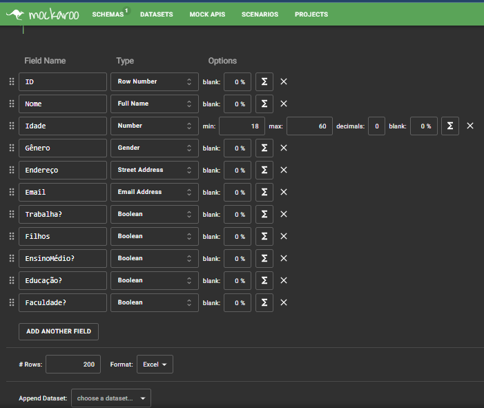
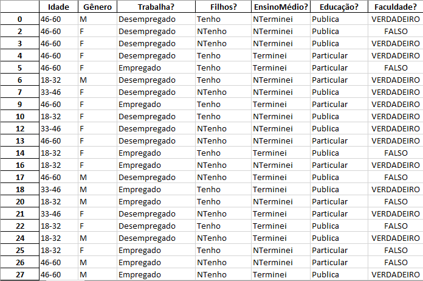
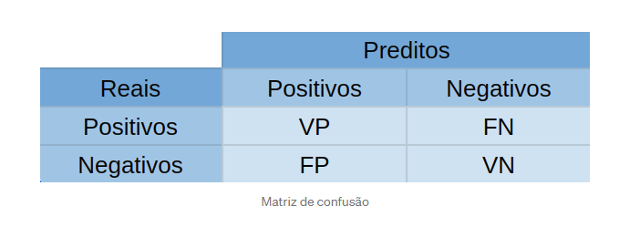
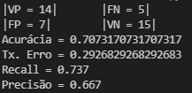

# Implementa-o-de-um-classificador-no-processo-de-KDD

# Objetivo da Analise: Vai(True) ou Não(False) para Faculdade

Quaria uma problema que podesse classificar pessoas que iria ou não para faculdade, dependendo de varias condiçoes, como não achei uma tabela simples para criar está analize, descobrir uma site ***https://www.mockaroo.com/schemas/381414***

Atravez deste site, escolhi alguns atributos que iria colocar no processo de classificação(Idade,Filhos?,Trabalha?...) e minha coluna de analise(Faculdade?) e mais algumas colunas como Nome, email para simular uma tabela real, assim criando a ***Tabela.xlsx***.

Com a tabela pronta comecei a fase do KDD no arquivo ***KDD.py***, fiz a retirada de colunas que não queria, fiz a transformação de algumas resposta com para coluna ***Trabalha?*** que antes erá ***True e False*** para ***Empregado e Desempregado***, a transformação de Colunas com idade para faixa etaria dividindo entre 18-32, 33-46 e 46-60 anos para se adequa a idade estabelacida durante a criação da tabela.

Também no arquivo KDD.py fiz a separação dos casos aleatóriamente que seria usados para Treinamento e Teste usando a estrategia do ***"Hold Out"*** onde optei por 80%:20%, assim seria 160 dos caso para tabela ***Treinamento.xlsx*** e  40 restantante para ***Teste.xlsx***, com as duas subtabelas criadas adicionei uma coluna chamada ***Busca*** na tabela ***Teste.xlsx***, para quando gera a classificação.

Com processo do KDD concluido, comecei a gera o algoritmo do ***ID3*** no arquivo ***id3.py***,  onde separei manualmente os atributos que queria ultilizar para classificar, fazendo a entropia do da coluna ***Faculdade?*** e a entropia do atributo anlisado e calculava a entropia total(Ganho), aquela que obtece o maior ganho seria escolhido, separaria pelas suas possiveis resposta em outra subtabelas, e chamaria de novo para selecionar o proximo atributo com maior ganho,até quando não ouver mais atributos ou não tiver mais variações de resposta.

Agora com grafico gerado, vamos para faze de teste, onde ele pega cada linha da tabela teste e percorre o grafo até chega em uma classificação, e adicionado na tabela para ser comparado com real resposta, apois classificar geramos a matriz de confusão, sendo :

(imagem: https://medium.com/pyladiesbh/m%C3%A9tricas-de-avalia%C3%A7%C3%A3o-de-classificadores-6aadc3dacd51)

VP -> verdadeiro positivo,
VN-> verdadeiro negativo,
FP -> falso positivo,
FN -> falso negativo.

Com a matriz podemos calcular as metricas:

Acurácia = (VP + VN)/(VP + VN + FP + FN)
Tx. Erro = (FP + FN)/(VP + VN + FP + FN)
Recall =  VP / (VP + FN) 
Precisão = VP / (VP + FP)

Obtendo assim:
   

